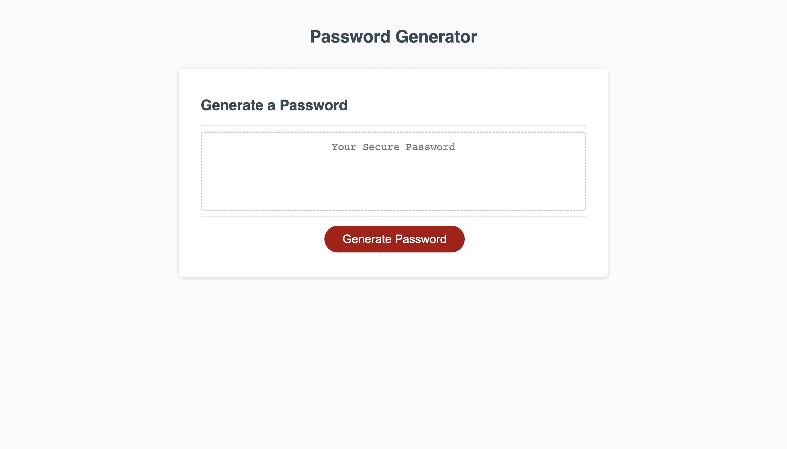
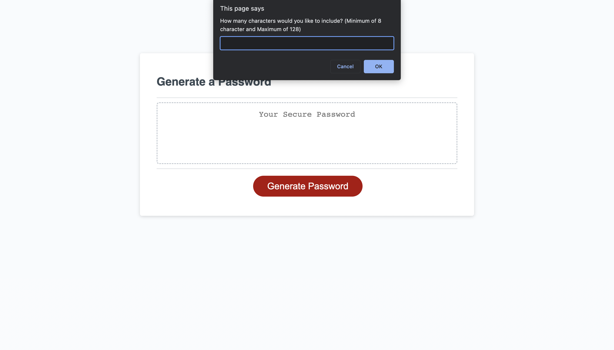

# MakeUrPASS 1.0

## Description

This website contains an interactive elements that asks the user series of prompts
whether to include lowercase, uppercase, number, special characters and amount of
characters that wants to be included. In each prompt, gives the user the opportunity to confirm their responses, or change their mind about adding the element. This also provides the opportunity to re-prompt the question to the user if the input is incorrect or input random keys accidentally. A password will display and replaces "Your Secure Password" placeholder after answering each prompt. 

## Usage

This password generator produces randomize secure password base on the criteria the user chooses and gives user opportunity to whether to include or not include certain criteria along the way by giving confirmation in each prompt.

## URL

https://junnel308.github.io/challenge3-password/

## Screenshots

## Credits

Robert Wijtman (Instructor), AskBCS Learning Assistance, Bootcamp Modules, Minjoo Park

## License

MIT License

Copyright (c) 2022 JP Padilla

Permission is hereby granted, free of charge, to any person obtaining a copy
of this software and associated documentation files (the "Software"), to deal
in the Software without restriction, including without limitation the rights
to use, copy, modify, merge, publish, distribute, sublicense, and/or sell
copies of the Software, and to permit persons to whom the Software is
furnished to do so, subject to the following conditions:

The above copyright notice and this permission notice shall be included in all
copies or substantial portions of the Software.

THE SOFTWARE IS PROVIDED "AS IS", WITHOUT WARRANTY OF ANY KIND, EXPRESS OR
IMPLIED, INCLUDING BUT NOT LIMITED TO THE WARRANTIES OF MERCHANTABILITY,
FITNESS FOR A PARTICULAR PURPOSE AND NONINFRINGEMENT. IN NO EVENT SHALL THE
AUTHORS OR COPYRIGHT HOLDERS BE LIABLE FOR ANY CLAIM, DAMAGES OR OTHER
LIABILITY, WHETHER IN AN ACTION OF CONTRACT, TORT OR OTHERWISE, ARISING FROM,
OUT OF OR IN CONNECTION WITH THE SOFTWARE OR THE USE OR OTHER DEALINGS IN THE
SOFTWARE.